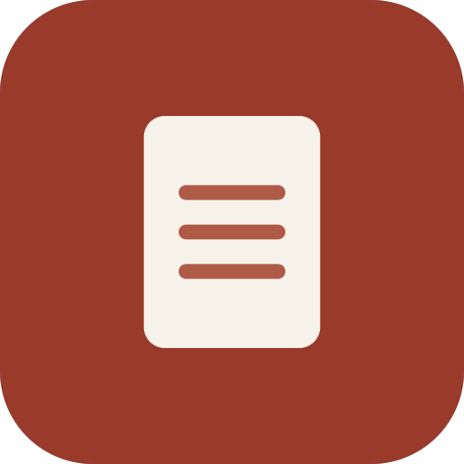
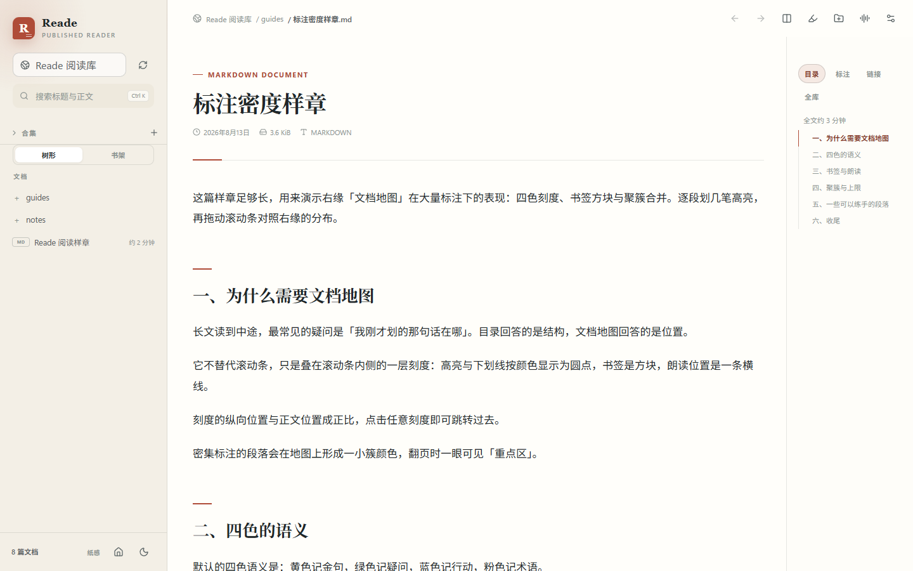
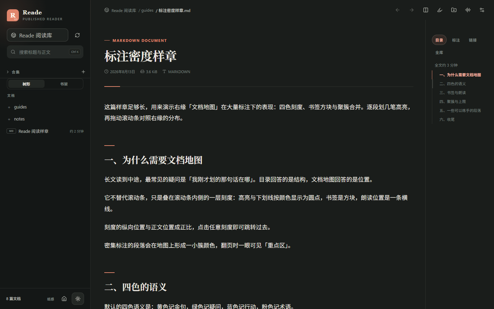

<div align="center">
  
  <h1>Reade</h1>
  <p><strong>A local-first long-form reader for Windows.</strong></p>
  <p>Open a folder of Markdown, PDF, and EPUB. Read in a three-pane layout,<br>highlight what matters, and review it later — with no account and nothing uploaded.</p>
  <p>
    <a href="https://github.com/RsLuna7/reade/releases/latest"></a>
    
    
    <a href="LICENSE"></a>
  </p>
  <p>
    <a href="https://github.com/RsLuna7/reade/releases/latest"><strong>Download for Windows</strong></a>
    ·
    <a href="docs/USER_GUIDE.md">User guide</a>
    ·
    <a href="README.zh-CN.md">中文</a>
  </p>
</div>

<p align="center">
  
</p>

## Why Reade

Most ebook apps want a library, an account, and a sync service. Reade wants a **folder**.

Point it at the directory where your papers, notes, and books already live. It discovers Markdown, PDF, and reflowable EPUB, then gets out of the way: a document tree on the left, the text in the middle, the chapter outline on the right. Typography is tuned for long Chinese and English reading — measure, line-height, paragraph rhythm — not for skimming a feed.

Highlights, notes, review cards, and reading stats stay in local SQLite. Reade never rewrites your files and never uploads them.

## Get started

1. [Download](https://github.com/RsLuna7/reade/releases/latest) the Windows installer and verify the SHA-256.
2. Open Reade and choose a folder of `.md`, `.pdf`, or `.epub` files (`Ctrl+O`).
3. Click a document. The tree, the article, and the outline are already there.

## Highlights

| | What you get |
| --- | --- |
| **Formats you already have** | `.md` / `.markdown` / `.mdx`, PDF (original layout), reflowable EPUB. Open a folder; Reade scans it recursively. |
| **Three-pane long-form layout** | Library, article, and outline scroll independently. Narrow windows collapse the side panes instead of crushing the text. |
| **Search that does not block reading** | Incremental SQLite FTS5 index in the background. The file tree appears first; full-text search catches up. |
| **Annotate without a cloud** | Highlights, underlines, short notes, and bookmarks. Optional spaced review and cloze cards — only for excerpts you opt in. |
| **Remember on purpose** | Quote cards, PDF region cards, whole-book digests, monthly reading reports, and an “On this day” home card. All rendered locally. |
| **Stay oriented** | Document map on the scrollbar, command palette (`Ctrl+P`), reading history (`Alt+←/→`), related passages, collections, and a cover bookshelf. |
| **Private by default** | No account, no telemetry, no auto-update phoning home. Remote images are off until you allow HTTPS. Raw HTML never runs. |

<details>
<summary><strong>More in the current release</strong></summary>

- GFM, footnotes, KaTeX, Shiki, and lazy Mermaid (strict + sanitized SVG)
- Focus mode: paragraph dimming, typewriter scrolling, reading ruler
- Split view for comparing two documents
- Experimental vertical writing for Markdown / EPUB
- Light / dark themes with optional ink-spread transitions
- Cover bookshelf (PDF first page, EPUB cover, generated Markdown covers)
- Library coverage treemap in reading stats
- Link hover previews and read-only backlinks (`[[wiki]]` included)
- Optional static Web build that publishes **public** Markdown to GitHub Pages

The [user guide](docs/USER_GUIDE.md) covers day-to-day use. This README stays a product page, not a changelog.

</details>

## Screenshots

<p align="center">
  
  <br>
  <em>Dark theme — same three-pane layout</em>
</p>

## Download

The current release is **Reade 0.2.0** for **Windows 10/11 x64**.

1. Download `Reade_0.2.0_x64-setup.exe` from **[Releases](https://github.com/RsLuna7/reade/releases/latest)**.
2. Confirm the SHA-256 before you run it:

   ```
   5E75445D723BF41022473D1C1FF0523CFB1ADCC7DC8BE795EFF46B8CED37C32F
   ```

3. Microsoft Edge **WebView2** is required. Most Windows 10/11 machines already have it.

The installer is **not code-signed** and there is **no auto-update**. Windows SmartScreen may warn about an unknown publisher. Continue only if the hash matches and you trust this repository.

## Privacy

- Documents stay in the folder you chose. Reade reads them; it does not copy the library into the cloud.
- Highlights, collections, and review data live in local SQLite under the app data directory — not inside your documents.
- Search text is a derived cache that can be deleted without touching annotations or stats.
- External links open only after you confirm. Remote images are blocked unless you opt in to HTTPS.
- There is no account, no analytics, and no “sign in to sync”.

## Documentation

- [User guide](docs/USER_GUIDE.md) — install, open a library, read, search, annotate, settings
- [Web publishing](docs/WEB_DEPLOY.md) — build a static site from Markdown you are willing to make public

Desktop is the product. The Web build is a frozen static publisher for public notes, not a second app.

## Develop

Prerequisites: Node.js 24, pnpm, Rust stable, WebView2, and the Windows C++ build tools required by Tauri 2.

```powershell
pnpm install
pnpm test
pnpm tauri dev
```

```powershell
pnpm tauri build          # Windows x64 NSIS installer
pnpm typecheck
cargo test --manifest-path src-tauri/Cargo.toml
cargo clippy --manifest-path src-tauri/Cargo.toml --all-targets -- -D warnings
```

Stack: Tauri 2 / Rust, React 19 / TypeScript / Zustand, PDF.js, and a custom EPUB path that does not execute in-book HTML/CSS. IPC goes through `src/lib/backend.ts`; file reads are relative paths that Rust canonicalizes inside the chosen library.

The sample library is `examples/demo-library`.

## Current limits

- Windows x64 only. No macOS, Linux, or mobile builds yet.
- EPUB is reflowable-only. No DRM, password PDFs, fixed-layout, or in-book SVG.
- No OCR, print, or Office conversion. Scanned PDFs are labeled as missing text rather than faked.
- Highlights can drift after a document is heavily edited. Clear-per-document and in-session undo are supported; there is no cloud reconciliation.
- The installer is unsigned.

## License

[MIT](LICENSE)
