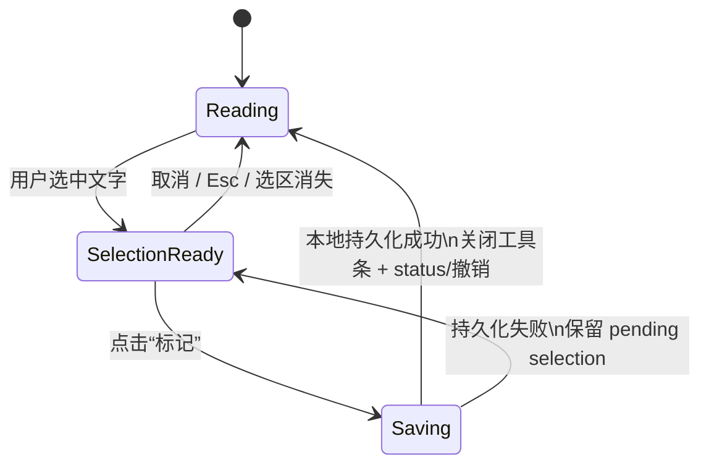
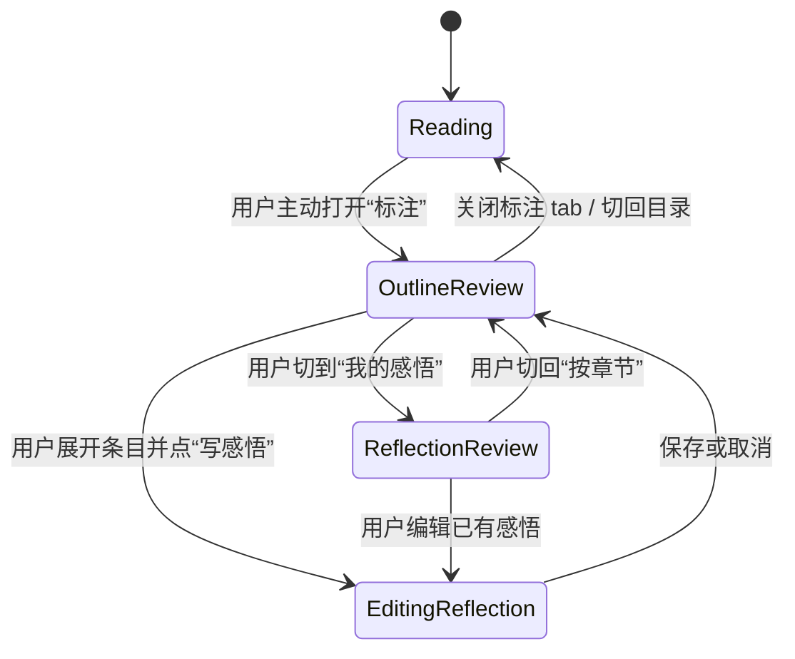
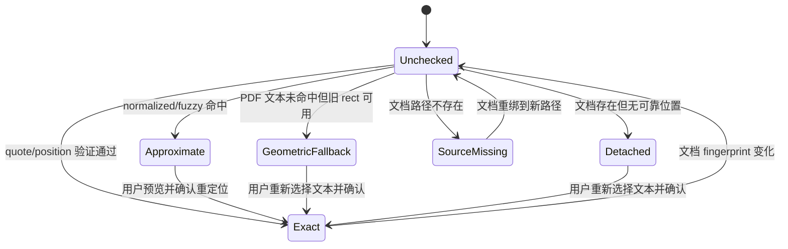
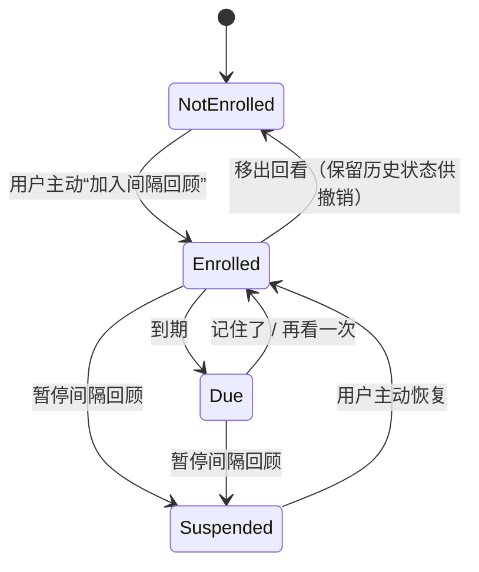

# Reade 标注系统重设计实施规格

- 日期：2026-08-24
- 状态：**方向已确认，规格待审查；未获再次批准前不得实施**
- 目标：从真实阅读流程重新定义“捕获—回看—补充感悟—再利用”，同时完整保留旧标注数据和回滚能力。
- 已确认偏好：阅读优先；标注主要用于记录重点或有感悟之处；感悟通常在读完后补写；系统不主动提醒复盘；颜色减为三种且降低突兀感。

> 一句话：阅读时只做安静、可撤销的留痕；用户主动回看时，再按原文章节浏览重点或只看自己的感悟。

---

## 0. 阶段边界与停止条件

本文是实现规格，不是实施授权。

- 本阶段允许：审查概念、流程、契约、迁移、文件范围和验收条件。
- 本阶段禁止：修改产品代码、升级依赖、迁移真实 SQLite/IndexedDB、改 CSP/capability、生成发布产物。
- 下一阶段入口：用户再次明确批准实施。
- 实施强制停止条件：
  - 任一迁移对账出现 ID、记录数、墓碑、笔记或回顾状态不一致；
  - Web 本地备份未完成或空间不足；
  - PDF 旧矩形仍被界面表达成精确文本定位；
  - Desktop/Web 同一输入经过共享校验后产生不同语义结果；
  - 需要删除旧表、旧 IndexedDB store 或旧导出能力才能继续。

## 1. 冻结的产品约束

### 1.1 必须成立

1. **阅读面不被标注接管**：保存后不得自动切换右侧 tab、展开列表、打开笔记框、跳转视图或触发读后提醒。
2. **捕获首层只有留痕**：默认操作是“标记”；颜色、下划线、卡片、相关段落和分享链接属于二级操作。
3. **感悟后补**：感悟只在用户主动打开本文标注后编辑，不在普通选区捕获链中催促。
4. **两种回看线索同时存在**：
   - 按原文章节/页段/EPUB 章节回看全部重点；
   - “我的感悟”只显示带感悟的条目，但仍保留原文章节出处。
5. **无强制整理**：不引入收件箱、未整理数字、文末卡片、打卡或到期焦虑。
6. **回顾显式加入**：新摘录不自动进入间隔回顾；没有 enrollment 就没有队列资格。
7. **三色、低彩度、非语义**：颜色只控制外观，不表达“金句/疑问/行动/术语”等知识类别。
8. **旧数据不丢**：旧高亮、下划线、书签、颜色、笔记、墓碑和已持久化回顾状态均可对账、可导出、可回滚。
9. **格式差异诚实**：Markdown、PDF 原版式、PDF 阅读视图、EPUB 和书签使用不同锚点；失败时不得伪造精确定位。
10. **本地优先不退化**：无账号、无云同步、无遥测、无新增网络依赖或权限。

术语固定：用户主动按章节查看并补写感悟叫“本文复盘”；有 enrollment、按 dueAt 调度的能力只叫“间隔回顾”。两者不得在 UI 中都简称“回顾”。

### 1.2 本期明确不做

- 不做主题图谱、双向链接、知识卡之间的关系图。
- 不做自动摘要、AI 分类、自动标签或自动生成感悟。
- 不做文末主动复盘入口或系统通知。
- 不把 PDF 区域引用卡片自动升级为可搜索文字摘录；扫描 PDF 仍须诚实标为无文本。
- 不在首个垂直切片中删除旧标注表或旧 IndexedDB stores。
- 不把用户数据库从 `app_cache_dir` 搬到 `app_data_dir`；该风险另立迁移，避免与 schema v6 同时改变两个高风险变量。

---

## 2. 新旧概念映射

| 旧概念/字段 | 新概念 | 迁移规则 | 新语义 |
|---|---|---|---|
| `Annotation(kind=highlight)` | `Excerpt` + `appearance.style=highlight` | ID、anchor、文本、时间戳、墓碑原样保留 | 摘录是来源证据；highlight 只是画法 |
| `Annotation(kind=underline)` | `Excerpt` + `appearance.style=underline` | 同上 | 与高亮不是不同知识类型 |
| `Annotation(kind=bookmark)` | `ReadingPlace` | ID、target、title、时间戳、墓碑原样保留 | 阅读位置与摘录分离 |
| `note` | `Reflection` | 非空 note 复制为一条一对一 reflection | 用户自己的感悟，不再混在来源字段中 |
| `selectedText` | `Excerpt.sourceText` | 原样复制；超过上限的历史合法值不截断 | 创建时看到的来源快照 |
| Markdown/PDF/EPUB locator | `SourceAnchor` 判别联合 | 逐字段无损映射 | 格式能力明确分叉 |
| `color=yellow` | `tone=sand` | 保留 `legacyColor=yellow` | 暖砂外观 |
| `color=green` | `tone=sage` | 保留 `legacyColor=green` | 青灰外观 |
| `color=blue` | `tone=slate` | 保留 `legacyColor=blue` | 墨蓝外观 |
| `color=pink` | `tone=sand` | **显示映射**为暖砂；底层保留 `legacyColor=pink` | 新 UI 只出现三色，旧筛选/导出仍可辨认粉色来源 |
| 颜色语义名偏好 | 旧兼容偏好 | 不转成标签；旧值只在兼容导出中保留 | 新颜色名称固定为暖砂/青灰/墨蓝 |
| `annotation_reviews` 有行 | `ReviewEnrollment` | 状态逐字段复制，记录 `enrolledAt` | 已有持久回顾行为继续存在 |
| `annotation_reviews` 无行 | 无 enrollment | 不物化隐式 due 状态 | 新旧未持久回顾意图均不再自动入池 |
| broken/approximate 内存集合 | `AnchorResolution` | 不迁移；按当前文档 revision 重算 | 派生状态，不冒充用户数据 |
| 全库中枢 | 二级“全库摘录” | 保留搜索/导出，降低 IA 优先级 | 日常回看先解决单篇长文 |
| 读书报告 | “本文复盘”的再利用动作 | 基于 Excerpt + Reflection 动态生成 | 不自动保存，不主动提醒 |
| 金句卡片/相关段落/分享链接 | “更多/再利用”动作 | 能力保留，退出捕获首层 | 输出不与保存竞争 |
| 清空本文档 | 首期移除入口 | 旧 command 暂留兼容层，不从新 UI 调用 | 在持久批量墓碑方案完成前不承诺可恢复清空 |

### 2.1 为什么不把“重点/感悟”设计成两个颜色或两个类型

- 重点是 `Excerpt` 本身。
- 感悟是与该摘录关联的 `Reflection`。
- 同一重点可以先无感悟、以后补感悟；概念之间不存在互斥转换。
- 颜色只改变视觉，不会因为用户换色而改写历史含义。

---

## 3. 信息架构与界面规格

### 3.1 阅读阶段

普通浏览模式的选区工具条：

```text
┌────────────────┐
│  标记    更多 ··· │
└────────────────┘
```

- “标记”以最近一次 tone 保存 highlight；首次默认 `sand`。
- “更多”展开：三色、下划线、相关段落、卡片、Web 链接。
- 书签不属于文字选区，退出选区工具条；保留 `Ctrl+B` 和独立顶栏入口。
- 连续高亮/下划线模式暂留为专家功能，但默认不启用、不持久化 armed 状态，也不得切换右栏。
- 保存成功：工具条立即关闭，选区释放，显示短暂 `role=status`：“已标记 · 撤销”。
- 保存失败：保留 pending selection 数据和工具条，显示错误及“重试”；不得假装已保存。
- 无论成功失败，右侧当前 tab、展开章节和滚动位置都不得被改变。

### 3.2 用户主动进行本文复盘

入口仍为右侧“标注”，但内容改为结构化视图：

```text
本文标注
32 条重点 · 9 个章节 · 6 条感悟

[ 按章节 ] [ 我的感悟 ]    [搜索本文]

▾ 一、为什么需要文档地图                 6
   摘录文本第一行……
   摘录文本第一行……                 有感悟

› 二、四色的语义                         8
› 三、定位与失效                         5
```

规则：

- 默认 `view=outline`；按文档顺序显示所有含条目的章节。
- 当前阅读章节首次打开时展开，其余折叠；用户手动折叠状态仅保留本次会话。
- `view=reflections` 只过滤出有 Reflection 的条目，仍按章节分组。
- 摘录卡默认一行，展开后显示完整 sourceText、感悟、位置和二级操作。
- 条目操作在 hover/focus/展开态出现；键盘用户不依赖 hover。
- 默认按原文位置排序；按时间降到“更多”。
- 搜索默认只在当前文档的 sourceText + reflection body 中匹配。
- 标注保存时仅更新 tab 的静态计数，不自动激活 tab，不使用跳动徽标或动效吸引注意。

### 3.3 分组回退规则

| 格式 | 一级分组 | 无结构回退 |
|---|---|---|
| Markdown/MDX | heading 层级；复用 TOC 归因 | 单组“全文” |
| PDF | Outline 页码区间 | 每 20 个物理页一个页段，如“第 1–20 页” |
| EPUB | chapter；章内 heading 只作位置说明 | chapter 天然存在，无额外回退 |
| ReadingPlace | 按 target 所属章节/页段归入 | 无法归因时进入末尾“未归属” |

### 3.4 全库与再利用

- “全库摘录”是用户主动进入的二级视图，不在侧栏和主页制造提醒。
- 默认筛选：来源文档、是否有感悟、是否加入回看、定位状态；tone 只作外观筛选。
- 文档合集只作为来源范围：选择“合集：考研数学”即动态过滤该合集中文档的摘录，不建立重复的 excerpt→collection 归属。
- 读书报告、Markdown、JSON、CSV、PNG 卡片集中在“再利用”菜单。
- 主页不显示“今日回顾”卡、到期数量或红点；即使有 enrollment，也只能从用户主动打开的“全库摘录 → 间隔回顾”或命令面板进入，不发通知、不在读完时出现卡片。

### 3.5 三色视觉契约

| tone | 中文名 | Light/PDF 色点 | Light fill | Light line | Dark 色点 | Dark fill | Dark line |
|---|---|---|---|---|---|---|---|
| `sand` | 暖砂 | `#B5965D` | `rgb(181 150 93 / 22%)` | `#7F6537` | `#C7AA72` | `rgb(199 170 114 / 22%)` | `#D0B680` |
| `sage` | 青灰 | `#6E938A` | `rgb(110 147 138 / 20%)` | `#4D6F67` | `#88AAA1` | `rgb(136 170 161 / 22%)` | `#9ABBB2` |
| `slate` | 墨蓝 | `#6D829D` | `rgb(109 130 157 / 20%)` | `#50657F` | `#899DB7` | `rgb(137 157 183 / 22%)` | `#9FB2C9` |

- PDF 页面恒为白色，始终使用 Light/PDF 值。
- 所有 tone 控件必须带“暖砂/青灰/墨蓝”文字或可访问名称；任何含义不得只靠颜色传达。
- 首个视觉验收可微调数值，但不得增加第四种新颜色，也不得把 fill 透明度提高到 30% 以上。

---

## 4. 用户流程与状态图

### 4.1 静默捕获



不变量：整个状态机不得改变右侧 tab、打开全屏视图或创建 Reflection。

### 4.2 主动进行本文复盘与补充感悟



不存在 `Reading → OutlineReview` 的系统自动转换；滚到文末、关闭文档或完成阅读都不能触发它。

### 4.3 锚点解析



- `Exact`：可以声称“回到原文”。
- `Approximate`：显示“非精确定位”，重绑前必须预览确认。
- `GeometricFallback`：只显示“旧版面位置”，不得声称引文仍匹配。
- `Detached`：条目与感悟保留，可打开文档附近位置，但不得绘制伪精确高亮。
- `Unchecked`：未在当前文档 revision 上验证，不等于失效。

### 4.4 显式加入间隔回顾



新 Excerpt 永远从 `NotEnrolled` 开始。

---

## 5. 格式与运行时能力矩阵

| 能力 | Markdown/MDX Desktop | Markdown/MDX Web | PDF 原版式 Desktop | PDF 阅读视图 Desktop | EPUB Desktop |
|---|---:|---:|---:|---:|---:|
| 文字 Excerpt | 是 | 是 | 有文本层时 | 有提取文本时 | 是 |
| ReadingPlace | heading + ratio | heading + ratio | page + offset | page + offset | chapter + heading + ratio |
| 精确锚点 | quote + context + offsets | 同左 | page + quote + live rect | page + quote | chapter/block + quote + offsets |
| 空白归一化 | 否（避免过宽） | 否 | 是 | 是 | 是 |
| fuzzy | 用户显式开启或重定位时 | 同左 | 同左 | 同左 | 同左 |
| 文本失败回退 | heading/Detached | 同左 | GeometricFallback/page | page/Detached | block/chapter/Detached |
| 扫描内容 | 不适用 | 不适用 | 不能伪造文字；区域卡仍是输出 | 无 OCR 则不可摘录 | 不适用 |
| 本地存储 | SQLite | IndexedDB | SQLite | SQLite | SQLite |

Web 不新增 PDF/EPUB 能力；共享的是语义和 DTO，不是假装格式支持同构。

---

## 6. TypeScript 核心契约

新类型建议放在 `src/lib/annotationModel.ts`，成为 Rust serde DTO、IndexedDB record 和 UI 的共同语义真源。下面字段名固定为 camelCase；Rust 使用 snake_case 字段并以 `#[serde(rename_all = "camelCase")]` 对齐。

```ts
export type AnnotationTone = "sand" | "sage" | "slate";
export type ExcerptStyle = "highlight" | "underline";
export type EntryKind = "excerpt" | "place";

export interface TextQuoteSelector {
  exact: string;
  prefix: string;
  suffix: string;
}

export interface SourceRevision {
  contentHash: string;
  observedAt: number;
  /** legacy 行只能声明“迁移时看到”，不能伪装成创建时版本。 */
  basis: "capture" | "migrationSnapshot";
}

export type SourceAnchor =
  | {
      format: "markdown";
      quote: TextQuoteSelector;
      headingId: string | null;
      start?: number;
      end?: number;
    }
  | {
      format: "pdfText";
      page: number;
      view: "original" | "reading";
      quote: TextQuoteSelector;
      rects: AnnotationRect[];
      pageWidth?: number;
      pageHeight?: number;
    }
  | {
      format: "epub";
      chapterId: string;
      blockIndex: number;
      startOffset: number;
      endOffset: number;
      quote: TextQuoteSelector;
      start?: number;
      end?: number;
    };

export interface ExcerptAppearance {
  style: ExcerptStyle;
  tone: AnnotationTone;
}

export interface Excerpt {
  id: string;
  relativePath: string;
  sourceText: string;
  anchor: SourceAnchor;
  sourceRevision: SourceRevision | null;
  appearance: ExcerptAppearance;
  sortIndex: string;
  createdAt: number;
  updatedAt: number;
  deletedAt: number | null;
  /** 只供回滚/旧筛选/导出；新 UI 不把它当语义。 */
  legacyKind: "highlight" | "underline" | null;
  legacyColor: "yellow" | "green" | "blue" | "pink" | null;
  legacyTitle: string | null;
  legacySelectedText: string | null;
}

export type ReadingPlaceTarget =
  | { format: "markdown"; headingId: string | null; scrollRatio: number }
  | { format: "pdf"; page: number; offsetRatio: number }
  | {
      format: "epub";
      chapterId: string;
      headingId: string | null;
      scrollRatio: number;
    };

export interface ReadingPlace {
  id: string;
  relativePath: string;
  title: string | null;
  target: ReadingPlaceTarget;
  sourceRevision: SourceRevision | null;
  sortIndex: string;
  createdAt: number;
  updatedAt: number;
  deletedAt: number | null;
  legacyColor: "yellow" | "green" | "blue" | "pink" | null;
  legacySelectedText: string | null;
}

/** v1 保持一条 entry 至多一条感悟；不提前引入评论线程。 */
export interface Reflection {
  entryId: string;
  entryKind: EntryKind;
  body: string;
  createdAt: number;
  updatedAt: number;
  deletedAt: number | null;
}

export interface ReviewEnrollment {
  excerptId: string;
  enrolledAt: number;
  box: number;
  dueAt: number;
  lastReviewedAt: number | null;
  totalReviews: number;
  suspended: boolean;
  updatedAt: number;
  deletedAt: number | null;
}

export type AnchorResolution =
  | { status: "unchecked" }
  | { status: "exact"; method: "hint" | "exact" }
  | { status: "approximate"; method: "normalized" | "fuzzy" }
  | { status: "geometricFallback"; page: number }
  | { status: "detached"; fallback: "heading" | "page" | "chapter" | null }
  | { status: "sourceMissing" };

export interface DocumentAnnotationBundle {
  excerpts: Excerpt[];
  places: ReadingPlace[];
  reflections: Reflection[];
  reviewEnrollments: ReviewEnrollment[];
}
```

### 6.1 创建与更新输入

客户端负责捕获 Range 和生成 UUID；存储实现负责校验、补时间戳并盖上当前文档 revision。

```ts
export interface ExcerptDraft {
  id: string;
  relativePath: string;
  sourceText: string;
  anchor: SourceAnchor;
  appearance: ExcerptAppearance;
  sortIndex: string;
}

export interface ReadingPlaceDraft {
  id: string;
  relativePath: string;
  title: string | null;
  target: ReadingPlaceTarget;
  sortIndex: string;
}

export interface AnnotationRepository {
  listDocumentAnnotations(relativePath: string): Promise<DocumentAnnotationBundle>;
  createExcerpt(draft: ExcerptDraft): Promise<Excerpt>;
  updateExcerptAppearance(
    id: string,
    appearance: ExcerptAppearance,
  ): Promise<Excerpt>;
  createReadingPlace(draft: ReadingPlaceDraft): Promise<ReadingPlace>;
  upsertReflection(
    entryId: string,
    entryKind: EntryKind,
    body: string,
  ): Promise<Reflection>;
  deleteReflection(entryId: string): Promise<void>;
  deleteAnnotationEntry(id: string, entryKind: EntryKind): Promise<void>;
  restoreAnnotationEntry(id: string, entryKind: EntryKind): Promise<void>;
  setReviewEnrollment(excerptId: string, enabled: boolean): Promise<ReviewEnrollment | null>;
  searchAnnotationEntries(query: AnnotationSearchQuery): Promise<AnnotationSearchHit[]>;
}
```

`src/lib/backend.ts` 继续是运行时选择 facade；Desktop 实现落 `tauriBackend.ts`，Web 实现落新的 `webAnnotationRepository.ts`。UI 不直接 import Tauri 或 IndexedDB 模块。

### 6.2 共享校验规则

建议建立 `src/lib/annotationValidation.ts`，Web 写入、导入解析和前端预检使用同一规则；Rust 实现逐条孪生测试。

| 字段 | 新建规则 | 迁移规则 |
|---|---|---|
| id | `[A-Za-z0-9_-]`，1–64 字符 | 已有合法值原样保留 |
| relativePath | 规范化库内相对路径；禁止绝对路径与 `..` | 任一非法行使整次迁移失败 |
| sourceText / quote.exact | 去空白后非空，最多 2,000 code points | 历史合法值不二次截断 |
| prefix/suffix | 新建各最多 32 code points | 旧值允许至当前 2,000 上限 |
| reflection body | trim 后非空，最多 4,000 code points | 旧 note 原样保留 |
| PDF rects | 最多 64；每项 finite，尺寸 >0，归一化范围允许少量浮点容差 | 旧 rect 无损复制；越界只标 geometricFallback，不静默修值 |
| ratio | finite 且 `0..=1` | 非法记录阻断迁移 |
| timestamps | create/update 由存储层盖章；import 走专用保留路径 | 原值保留，`updatedAt >= createdAt` |
| tone/style | 枚举白名单 | 按 §2 映射并保留 legacy 字段 |
| sortIndex | 固定宽度格式，与 Rust 推导逐字节一致 | 空值重算；坏值使用 `BROKEN_SORT_INDEX` 并进入对账报告 |

超过 2,000 字符的实时选区不得“截一半后悄悄保存”：应保留选区并提示缩短，避免 Desktop 拒绝、Web 接受的现有分歧。

### 6.3 长文分组纯函数

新建 `src/lib/annotationOutline.ts`：

```ts
interface AnnotationOutlineInput {
  format: DocumentFormat;
  toc: TocItem[];
  excerpts: Excerpt[];
  places: ReadingPlace[];
  reflectionsByEntryId: ReadonlyMap<string, Reflection>;
  currentTocId: string | null;
}

interface AnnotationOutlineSection {
  id: string;
  title: string;
  level: number;
  entries: Array<Excerpt | ReadingPlace>;
  excerptCount: number;
  reflectionCount: number;
  current: boolean;
}
```

- 章节归因优先复用 `tocHeat.ts` / `bookDigest.ts` 已验证的 attributor，不复制另一套边界算法。
- `view=reflections` 是对同一 outline 的纯过滤，不维护第二份列表状态。
- 合成用例至少覆盖 1,000 条记录，分组计算预算 <50ms；DOM 首次只展开当前章节，避免一次挂载全部卡片。

---

## 7. Rust、SQLite 与 IPC 契约

### 7.1 SQLite schema v6（纯新增，旧表保留）

`USER_SCHEMA_VERSION: 5 → 6`，迁移沿当前事务链与升级前备份机制执行。

```sql
CREATE TABLE excerpts (
    id TEXT PRIMARY KEY,
    library_root TEXT NOT NULL,
    relative_path TEXT NOT NULL,
    source_text TEXT NOT NULL,
    anchor_json TEXT NOT NULL,
    source_revision_json TEXT,
    style TEXT NOT NULL,
    tone TEXT NOT NULL,
    legacy_kind TEXT,
    legacy_color TEXT,
    legacy_title TEXT,
    legacy_selected_text TEXT,
    sort_index TEXT NOT NULL,
    searchable_text TEXT NOT NULL DEFAULT '',
    created_at INTEGER NOT NULL,
    updated_at INTEGER NOT NULL,
    deleted_at INTEGER
);
CREATE INDEX excerpts_by_doc
    ON excerpts(library_root, relative_path, sort_index, id);
CREATE VIRTUAL TABLE excerpts_fts USING fts5(
    searchable_text,
    content = 'excerpts',
    tokenize = 'trigram'
);
-- 与现有 annotations_fts 一致的 INSERT/UPDATE/DELETE triggers；
-- Reflection 更新时 command 同事务重算 excerpts.searchable_text。

CREATE TABLE reading_places (
    id TEXT PRIMARY KEY,
    library_root TEXT NOT NULL,
    relative_path TEXT NOT NULL,
    title TEXT,
    target_json TEXT NOT NULL,
    source_revision_json TEXT,
    legacy_color TEXT,
    legacy_selected_text TEXT,
    sort_index TEXT NOT NULL,
    created_at INTEGER NOT NULL,
    updated_at INTEGER NOT NULL,
    deleted_at INTEGER
);
CREATE INDEX reading_places_by_doc
    ON reading_places(library_root, relative_path, sort_index, id);

CREATE TABLE reflections (
    entry_id TEXT PRIMARY KEY,
    entry_kind TEXT NOT NULL,
    library_root TEXT NOT NULL,
    body TEXT NOT NULL,
    created_at INTEGER NOT NULL,
    updated_at INTEGER NOT NULL,
    deleted_at INTEGER
);

CREATE TABLE review_enrollments (
    excerpt_id TEXT PRIMARY KEY,
    library_root TEXT NOT NULL,
    enrolled_at INTEGER NOT NULL,
    box INTEGER NOT NULL,
    due_at INTEGER NOT NULL,
    last_reviewed_at INTEGER,
    total_reviews INTEGER NOT NULL DEFAULT 0,
    suspended INTEGER NOT NULL DEFAULT 0,
    updated_at INTEGER NOT NULL,
    deleted_at INTEGER
);
CREATE INDEX review_enrollments_due
    ON review_enrollments(library_root, suspended, due_at);

CREATE TABLE annotation_v6_migration (
    library_root TEXT PRIMARY KEY,
    legacy_total INTEGER NOT NULL,
    excerpt_total INTEGER NOT NULL,
    place_total INTEGER NOT NULL,
    reflection_total INTEGER NOT NULL,
    enrollment_total INTEGER NOT NULL,
    source_checksum TEXT NOT NULL,
    target_checksum TEXT NOT NULL,
    migrated_at INTEGER NOT NULL
);
```

- 不启用新 foreign key；沿当前 command 层 ownership 校验和 purge 约定，避免与既有连接设置冲突。
- 单条删除写墓碑。Excerpt 的 Reflection 同事务写墓碑；ReviewEnrollment 在墓碑保留期内保留，允许恢复后继续原进度。
- 移出回看给 ReviewEnrollment 写 `deleted_at`，不立即抹掉历史；重新加入可复活原状态或由用户选择重置。
- 物理清理时删除对应 Reflection、ReviewEnrollment 和兼容旧 review 行。
- 新 UI 不调用物理 `clear_document_annotations`；它暂留旧兼容路径。

### 7.2 Rust DTO

- `ExcerptTone::{Sand, Sage, Slate}`、`ExcerptStyle::{Highlight, Underline}`。
- `SourceAnchor::{Markdown, PdfText, Epub}` 与 §6 逐字段对应。
- `Excerpt`、`ReadingPlace`、`Reflection`、`ReviewEnrollment` 均使用 serde camelCase。
- `AnchorResolution` 是前端渲染/解析结果，不经 user SQLite 持久化。
- 新建 command 在 Rust 端读取 `documents.content_hash`，返回 `SourceRevision{basis:"capture"}`；读取不到时为 `None`，不得阻断本地捕获。

### 7.3 IPC commands

| Rust command | TS wrapper | 关键参数 | 返回 |
|---|---|---|---|
| `list_document_annotations` | `listDocumentAnnotations` | `relative_path` | `DocumentAnnotationBundle` |
| `create_excerpt` | `createExcerpt` | `draft` | `Excerpt` |
| `update_excerpt_appearance` | `updateExcerptAppearance` | `id, appearance` | `Excerpt` |
| `create_reading_place` | `createReadingPlace` | `draft` | `ReadingPlace` |
| `upsert_reflection` | `upsertReflection` | `entry_id, entry_kind, body` | `Reflection` |
| `delete_reflection` | `deleteReflection` | `entry_id` | `()` |
| `delete_annotation_entry` | `deleteAnnotationEntry` | `id, entry_kind` | `()` |
| `restore_annotation_entry` | `restoreAnnotationEntry` | `id, entry_kind` | `()` |
| `set_review_enrollment` | `setReviewEnrollment` | `excerpt_id, enabled` | `Option<ReviewEnrollment>` |
| `search_annotation_entries` | `searchAnnotationEntries` | `query` | `Vec<AnnotationSearchHit>` |
| `record_excerpt_review_outcome` | `recordExcerptReviewOutcome` | review state fields | `()` |

规则：

- 所有写 command 必须验证 open library ownership；import 是唯一允许缺失路径的专用路径。
- Rust 参数 snake_case，前端 `invoke` key camelCase；`tauriBackend.test.ts` 必须逐条断言。
- `create_excerpt` 与兼容旧行写入在一个 SQLite transaction 中；不能出现新表成功、旧表失败。
- search 只读、root scoped、墓碑排除，查询上限继续为 256 字符/500 结果。

### 7.4 一个兼容发布周期的双写投影

为了允许回退到旧 UI/旧应用版本，v6 的每次写入同步维护旧表：

| v6 操作 | 旧表投影 |
|---|---|
| 创建 Excerpt | 写 `annotations`；style→kind，sand/sage/slate→yellow/green/blue |
| 更新 appearance | 更新旧 kind/color；未改 tone 的 legacy pink 继续保留 pink |
| 创建/更新 Reflection | 更新旧 `annotations.note` |
| 创建 ReadingPlace | 写旧 bookmark annotation |
| 删除/恢复 entry | 同步旧 tombstone/复活 |
| 未加入回看的 Excerpt | 在旧 `annotation_reviews` 写 `suspended=1,total_reviews=0`，阻止旧版隐式入池 |
| 加入/恢复间隔回顾 | 同步旧 review row 为非 suspended |
| 移出间隔回顾 | 新 enrollment 移除/保留审计状态；旧 review row 置 suspended |

旧表至少保留一个稳定发布周期。停止双写、删除旧表或提升导出格式为只读 v2 都必须另行批准。

---

## 8. Web IndexedDB twin

### 8.1 DB v6 stores

`DB_VERSION: 5 → 6`，保留现有 `annotations`、`documents`、`annotationReviews`、`collections`、`collectionItems`：

| store | keyPath | indexes |
|---|---|---|
| `excerpts` | `id` | `relativePath`、`sortIndex`、`updatedAt` |
| `readingPlaces` | `id` | `relativePath`、`sortIndex` |
| `reflections` | `entryId` | `entryKind`、`updatedAt` |
| `reviewEnrollments` | `excerptId` | `dueAt`、`suspended` |
| `annotationV6Meta` | `key` | 无 |

IndexedDB record 逐字段使用 §6 camelCase 结构；不得创建“Web 简化版”数据类型。

### 8.2 两阶段升级

Web 没有 SQLite 文件可直接复制，必须在打开 v6 前完成本地备份：

1. `prepareWebAnnotationV6Migration()` 先不指定更高版本打开旧 DB。
2. 若版本为 5，把五个旧 stores 复制到独立数据库 `reade-annotations-backup-v5-<timestamp>`。
3. 逐 store 对账 key 数量；空间不足、blocked、abort 或 quota error 均停止升级。
4. 关闭旧连接，再以 version 6 打开正式 DB。
5. `onupgradeneeded` 只做建 store 与 cursor 复制；任何 request error 主动 abort versionchange transaction。
6. 同一 upgrade transaction 写入 `{key:"annotationV6", status:"pending", counts...}`。
7. DB 打开后用 Web Crypto 对旧投影与新投影计算 checksum；一致后把状态改为 `ready`。
8. `status !== ready` 时，新 UI 禁用，继续使用旧 repository，并给出“标注升级未完成，数据仍由旧系统读取”的非破坏性提示。

备份数据库至少保留到用户完成一次显式 JSON 备份或一个稳定发布周期结束；删除备份必须是独立、可确认的维护动作。

### 8.3 Web 双写

- create/update/delete/restore/reflection/review 操作使用同时包含新旧 stores 的一个 `readwrite` transaction。
- transaction 完成前不更新 React 成功状态；abort 后 pending selection 或编辑草稿保留。
- `webAnnotationRepository.ts` 必须调用共享 `annotationValidation.ts`；不能重现当前“Web 只校验 sortIndex”的差异。
- 文档 presence 来自当前 manifest；普通创建必须要求路径存在，import 专用路径可接收失联记录。
- Web 只有一个同源静态库，没有 SQLite `library_root` 字段；facade 对外仍按当前 `DEFAULT_LIBRARY_ROOT` 语义隔离。
- Web 搜索在内存中以同一 NFKC/小写/字面子串契约匹配 `sourceText + reflection.body`；Desktop 的 `excerpts_fts.searchable_text` 使用相同拼接与规范化规则。

---

## 9. 迁移、对账与回滚

### 9.1 冻结兼容基线

实施获批后的第一个代码切片只建立 fixture 和账本，不先改 UI：

- 从当前 v5 schema 构造覆盖以下形态的固定数据集：
  - 三格式高亮、下划线、书签；
  - 四种旧颜色及自定义颜色名偏好；
  - 有/无 note；
  - live 与 tombstone；
  - 有 review row、suspended row、无 review row；
  - 存在、失联、已移动文档；
  - 两个 `library_root`；
  - 新旧 optional locator 字段混合。
- 冻结 v5 导出 JSON 和 SQLite 查询快照，作为迁移前真值。
- Desktop 与 Web 使用语义相同的 fixture 编号；测试名称标注 twin ID。

### 9.2 Desktop v5 → v6

迁移全部在现有 `run_migration_chain` transaction 中：

1. 当前机制先生成 `reade-user.backup-v5.sqlite3`。
2. 创建 v6 新表。
3. 按 `library_root, id` 稳定顺序读取旧 annotations，包括墓碑。
4. highlight/underline → excerpts；bookmark → reading_places；note → reflections。
5. `documents` 有匹配行时写 `SourceRevision{basis:migrationSnapshot}`；无行写 null。
6. 仅旧 `annotation_reviews` 有行者写 review_enrollments；无行者不加入回看，并在旧 review 表物化 `suspended=1` 兼容行。
7. 按 root 计算并核对：
   - `legacy_total == excerpt_total + place_total`；
   - 非空旧 note 数 == reflection_total；
   - **物化兼容 suspended 行之前记录的**旧 review 行数 == 新 enrollment 数；
   - sorted legacy projection checksum == sorted v6 reverse-projection checksum。
8. 每个 `library_root` 在独立 SAVEPOINT 内执行；该 root 任一记录无法解析、计数或 checksum 不同，则回滚该 SAVEPOINT、不写 ready ledger，并继续由 legacy repository 服务该 root。不得部分启用 v6，也不得删除坏行。
9. 全部 root 通过后写 migration ledger，再将 `user_version` 设为 6 并 commit。

checksum 至少包含：id、root、path、legacy kind/color、note、selectedText/title、locator JSON、sortIndex、created/updated/deleted timestamps。新模型反向投影后必须逐字节稳定；JSON object key 顺序先 canonicalize。

### 9.3 Web v5 → v6

- 映射规则与 Desktop 完全相同。
- `onupgradeneeded` 内不用 `await`；使用 cursor/request 回调保持 versionchange transaction 活跃。
- 升级后的异步 checksum 失败不删除 v6 stores，只将 meta 标为 `failed` 并继续旧读路径。
- 重新启动时若 meta 为 pending/failed，先重新对账；不得重复插入或覆盖用户新写数据。

### 9.4 运行期对账

兼容周期内提供只读诊断函数，不暴露任意 SQL：

```ts
interface AnnotationParityReport {
  legacyAnnotations: number;
  excerpts: number;
  places: number;
  reflections: number;
  legacyReviews: number;
  reviewEnrollments: number;
  sourceChecksum: string;
  targetChecksum: string;
  mismatchedIds: string[]; // capped at 100
  ok: boolean;
}
```

- Desktop 从 SQLite 两套表计算；Web 从两套 stores 计算。
- 开发/验收可查看报告，产品正常阅读不显示常驻健康徽标。
- `ok=false` 立即停止 v6 写入并回退旧 repository；不得自动“修复”或删除不匹配行。

### 9.5 回滚路径

| 情景 | 回滚动作 | 数据恢复性 |
|---|---|---|
| schema migration 事务失败 | 自动保持 v5，继续旧 UI | 完全恢复，无 v6 commit |
| v6 UI/逻辑缺陷 | feature gate 切回 legacy repository/UI | 双写保证兼容周期内新改动仍可见 |
| Desktop v6 数据损坏 | 停止应用写入；用户确认后从 backup-v5 或最近完整导出恢复 | 备份文件保留；不自动覆盖当前 DB |
| Web v6 对账失败 | 使用旧 stores；保留独立 backup DB；允许导出 | 不删除正式/备份任一 DB |
| 回退旧应用二进制 | 读取双写旧表/store | 新 reflection/appearance 可见；显式 enrollment 通过旧 suspended 行近似保持 |
| 兼容周期结束 | 只允许停止双写，不允许同批删除旧表 | 删除需另行设计和批准 |

旧应用不知道 `sand/sage/slate`，因此读取映射后的 yellow/green/blue；这是可接受的视觉降级，不是数据丢失。legacy pink 只有在用户主动改 tone 后才更新旧 color，否则维持原键。

### 9.6 完整备份格式

当前 annotation JSON 不含 reviews/collections/preferences，不能作为 v6 迁移的唯一回滚物。新增 `ReadeUserDataArchiveV2`：

- annotations v5 原始记录与 v6 canonical entries；
- reflections、review enrollments、旧 annotationReviews；
- document fingerprints；
- collections 与 collection items；
- annotation palette/version 及相关 reader preferences；
- export generator、timestamp、deviceId、schema versions、逐 section checksum。

导入必须先 dry-run，按 section 报新增/更新/墓碑/冲突/失联数，用户确认后再用单事务写入。v1 annotation envelope 继续可读，不反向要求旧版读 v2。

---

## 10. 分阶段文件修改清单

只有再次获得实施批准后按以下顺序执行。每阶段均可独立停下，禁止将阶段 1–6 合并成一次大改。

### 阶段 0：冻结基线与 fixture（无行为变化）

| 文件 | 预期修改 |
|---|---|
| `src/lib/annotationMigrationFixture.ts`（新） | 双端共享 fixture 编号与期望投影 |
| `src/lib/annotationMigrationFixture.test.ts`（新） | v5→v6 映射与 checksum 真值 |
| `src-tauri/src/user_store.rs` tests | 同编号 Rust fixture；暂不升 schema |
| `docs/plan-annotation-system-redesign.md` | 实施时记录偏差，不改变已确认方向 |

验收：旧测试全绿，fixture 快照稳定，产品 bundle 不引入 fixture。

### 阶段 1：纯模型、共享校验、分组与三色色板

| 文件 | 预期修改 |
|---|---|
| `src/lib/annotationModel.ts`（新） | §6 DTO 与映射纯函数 |
| `src/lib/annotationValidation.ts`（新） | Web/导入共享验证 |
| `src/lib/annotationOutline.ts`（新） | 章节/页段分组与感悟过滤 |
| 对应 `.test.ts` | 契约、边界、性能合成用例 |
| `src/App.css` | 新三色 tokens（阶段 1 先定义但不接线）；旧 token 暂留兼容别名 |
| `src/AppCss.test.ts` | token 完整性、PDF 白页固定色、三色上限机械检查 |

验收：纯逻辑可审查；新 tokens 尚未被旧 UI 使用，不改变当前 UI/持久化。

### 阶段 2：v6 存储、迁移账本与双写 repository

| 文件 | 预期修改 |
|---|---|
| `src-tauri/src/user_store.rs` | schema v6、迁移、对账、CRUD、双写、Rust tests |
| `src-tauri/src/lib.rs` | 注册新 commands，旧 commands 保留 |
| `src/lib/backend.ts` | 新 DTO/export facade，旧 wrapper 保留 |
| `src/lib/tauriBackend.ts` / test | invoke twin 与 exact key tests |
| `src/lib/webAnnotations.ts` | DB v6 建 store、升级前备份协调；旧 API 保留 |
| `src/lib/webAnnotationRepository.ts`（新） | 新 store CRUD、共享校验、双写 |
| `src/lib/webAnnotations.test.ts` | v5→v6、备份、abort、对账、双写 tests |

验收：默认仍渲染旧 UI；新 repository 通过 headless round-trip 和 parity report。

### 阶段 3：最小垂直切片——Markdown 静默标记与本文回看

| 文件 | 预期修改 |
|---|---|
| `src/lib/useDocumentAnnotationBundle.ts`（新） | 新 bundle hook；旧 `useDocumentAnnotations.ts` 保留给 legacy UI |
| `src/lib/annotationCapture.ts` | 输出 ExcerptDraft；超长选区统一拒绝 |
| `src/components/AnnotationUi.tsx` | 选区工具条收敛；新章节化列表可拆新组件 |
| `src/components/DocumentAnnotationsView.tsx`（新） | 按章节/我的感悟、Reflection editor |
| `src/store/useReaderStore.ts` / test | 新增 `excerptTone`（默认 sand），从旧 highlightColor 映射；旧颜色/命名偏好继续保留给 legacy UI |
| `src/App.tsx` | 定点接线；删除保存后 `setSidePanelTab("annotations")` 行为 |
| `src/App.css` / `src/AppCss.test.ts` | 静默工具条、长文密度、窄窗 bottom sheet |
| `src/App.test.tsx`、`src/components/AnnotationUi.test.tsx`、`DocumentAnnotationsView.test.tsx`（新） | 保存不切 tab、手动回看、感悟持久化、回原文 |

验收：见 §13；不改 PDF/EPUB 新捕获，旧 reader 继续兼容显示。

### 阶段 4：PDF/EPUB 锚点与失败状态

| 文件 | 预期修改 |
|---|---|
| `src/components/PdfReader.tsx` / tests | Exact/Approximate/GeometricFallback/Detached 回报与视觉 |
| `src/components/EpubReader.tsx` / tests | chapter/block 变化、chapter-level hint 修正 |
| `src/components/AnnotatedMarkdown.tsx` / tests | 统一 AnchorResolution callback |
| `src/lib/annotations.ts` / tests | resolver 返回明确状态，不把旧 rect fallback 当 null method 普通命中 |
| `src/lib/annotationRelocate.ts` / tests | 预览确认后才改 anchor；revision 更新 |

验收：三格式能力矩阵逐格走通，失败文案不伪造精确。

### 阶段 5：显式回看、全库搜索与再利用

| 文件 | 预期修改 |
|---|---|
| `src/lib/reviewScheduler.ts` / tests | 只接收 enrollment；移除隐式初始池 |
| `src/components/ReviewView.tsx` / tests | 加入/暂停/恢复；无主动提醒 |
| `src/components/HomeView.tsx` | 移除主动回顾卡与到期提示；间隔回顾入口移至用户主动打开的摘录视图/命令面板 |
| `src/lib/annotationSearch.ts` / `annotationHub.ts` | source/reflection/enrollment/status 筛选 |
| `src/components/AnnotationHubView.tsx` | 降为二级全库摘录视图 |
| `src/lib/annotationTransfer.ts` | UserDataArchiveV2 + v1 compatibility |
| `src/components/BookDigestView.tsx` / reading report | 以 Excerpt/Reflection 适配，不按颜色推断语义 |

验收：普通标记不进入回顾；旧已持久化 review 状态无损。

### 阶段 6：文档、运行时验收与兼容观察

- 更新 `README.md`、`docs/USER_GUIDE.md`；旧计划文档加“已被本规格取代”的链接，不复制新契约。
- 完整测试/构建/视觉矩阵。
- 保留旧表和双写，收集本地 parity report；不提交真实用户数据或截图中的隐私内容。

---

## 11. 自动化测试矩阵

### 11.1 数据与迁移

| 用例 | SQLite | IndexedDB | 共享 TS |
|---|:---:|:---:|:---:|
| fresh v6 / 重复打开幂等 | 必测 | 必测 | — |
| v5→v6 四色、三 kind、note、bookmark | 必测 | 必测 | fixture 真值 |
| live + tombstone + 90 天 purge | 必测 | 必测 | 映射 |
| 有 review row / 无 row / suspended | 必测 | 必测 | 调度语义 |
| 两个 library roots 隔离 | 必测 | Web 不适用 | — |
| 失联路径与 fingerprint | 必测 | 必测 | move fixture |
| 坏 locator/坏路径使整批 abort | 必测 | 必测 | validator |
| migration counts/checksum mismatch | 必测 | 必测 | checksum |
| 备份存在且可读 | 必测 | 独立 backup DB | archive parser |
| 新表写失败使旧表也 rollback | 必测 | 同 transaction abort | repository contract |
| 新旧双写反向投影一致 | 必测 | 必测 | parity report |
| 更新版本棘轮拒绝 | v7 DB | version >6 | parser version |

### 11.2 捕获与交互

- Markdown Desktop/Web：普通选区保存、重复文本 hint、heading 变更、超长选区拒绝。
- PDF original：quote 命中重测 rect、normalized、fuzzy、旧 rect 几何回退、无文本层。
- PDF reading：页内 quote、页面不存在、模式切换后重试。
- EPUB：block 存在/移动/删除、chapter 移动、重复 quote、空白变化。
- 保存成功后断言：
  - side panel tab 不变；
  - panel scroll 不变；
  - active view 不变；
  - focus/selection 清理正确；
  - status 含撤销动作。
- 保存失败后断言 pending selection 保留、无虚假成功、可重试。
- `Ctrl+Z` 对普通工具条保存和连续模式保存行为一致。
- 书签不出现在选区首层，`Ctrl+B` 与独立入口行为保持。

### 11.3 本文回看与长文规模

- Markdown heading、PDF Outline/20 页回退、EPUB chapter 的分组边界。
- “我的感悟”只过滤有 live Reflection 的条目，且保留章节分组。
- 当前章节首次展开；用户折叠态在同会话保持，重新打开应用不持久化。
- 未归属条目始终置尾，不丢失、不错误塞入最近章节。
- 1,000 条 entry 分组 <50ms；首屏 DOM 不超过展开章节内容 + section headers。
- 200 条单篇真实样本下搜索、折叠、写感悟、回原文无明显卡顿。

### 11.4 锚点诚实度

| 状态 | 自动化断言 |
|---|---|
| Exact | mark 与 quote 一致；点击落到 mark |
| Approximate | 有文字标签/aria-label；未确认不改 locator |
| GeometricFallback | PDF 仍可画 rect，但明确旧版面；不进入 exact 集合 |
| Detached | 条目与 Reflection 保留；不画伪高亮；跳转给出附近提示 |
| SourceMissing | 全库可见、不可跳转、可导出/重绑 |
| Unchecked | 不显示红色错误；document revision 变化后旧 exact 自动失效为 unchecked |

### 11.5 IPC、安全与导入导出

- 每个新 command 的注册、wrapper 名称和 camelCase key 有 exact tests。
- Desktop/Web 对同一非法 DTO 返回同类别错误；不允许 Web 接受 Rust 会拒绝的记录。
- sourceText/reflection/filename 按不可信文本渲染；不启用 raw HTML，不执行 Markdown/EPUB 携带代码。
- CSV formula injection、JSON 大小/条数上限、重复 ID、未知版本、危险路径继续回归。
- ArchiveV2 Desktop↔Web 往返包含 Reflection、ReviewEnrollment、Collections 和偏好；v1 导入继续成功。

### 11.6 无障碍

- SelectionToolbar 使用 `role=toolbar`；Tab 顺序为“标记→更多”，Esc 关闭并回到阅读面。
- 更多菜单三色均有文本/aria-label，不允许只有圆点。
- Reflection editor 有可访问名称、保存/取消、错误关联、焦点进入与返回；非模态则不用虚假 `aria-modal`。
- hover-only 操作在 keyboard focus/展开态可见。
- `prefers-reduced-motion` 与现有 motion level 下保存反馈不依赖动画才能感知。
- 640px coarse pointer 下主操作最小 44×44；浮层不遮住整个选段，必要时转 bottom sheet。

---

## 12. 真实运行时视觉验收

测试通过不等于视觉正确。每轮实现最多两次批量截图检查，修复集中处理。

### 12.1 色板矩阵

- 在 `paper/mist/ink/celadon × light/dark` 八种主题中，用同一段正文展示三色 highlight + 三色 underline。
- PDF 白页单独展示六种 mark；不得误用暗色主题 fill。
- 检查：不形成荧光色块、正文对比清晰、三色可区分、旧 pink 映射不突兀。
- 机械色值检查之外，必须打开原图查看；最终色值允许一次成组微调。

### 12.2 关键场景截图

| 场景 | 尺寸/运行时 |
|---|---|
| 保存前后对比，右侧仍停在目录 | Tauri 1440 light/dark |
| 选区工具条首层与更多菜单 | Tauri 1280；Web 640 coarse |
| 32 条/9 章节的按章节视图 | 1440、900、640 |
| “我的感悟”过滤及 Reflection 编辑 | light/dark、640 |
| Exact/Approximate/Detached/SourceMissing | light/dark |
| PDF GeometricFallback | 真实 PDF、100%/200%、单页/双页 |
| EPUB 长章节与窄窗 | 1100、760 |

### 12.3 视觉通过标准

- 标记后正文位置、右栏 tab、右栏滚动位置均不跳动。
- 首层选区工具条最多两个动作；更多菜单不与首层同时占据大块正文。
- 章节列表即使 100+ 条也首先呈现结构，而不是连续卡片墙。
- 色彩是辅助，不争夺正文注意力；默认暖砂在一屏多处出现时仍安静。
- 窄窗无横向溢出、按钮不被底部工具条遮挡、Reflection editor 可完整操作。
- 失败状态文案与视觉一致，不出现“看起来精确、实际只是页级/旧矩形”的情况。

---

## 13. 可独立交付的最小垂直切片（MVS）

### 13.1 范围

MVS 只打通 Markdown/MDX，但必须走真实 v6 双端存储，不允许用临时 localStorage 或只改 UI：

1. v5→v6 SQLite/IndexedDB 安全迁移、账本、备份、双写与 legacy fallback。
2. Markdown 选区 → 默认暖砂 Excerpt → 持久化成功 → 工具条关闭 → 可撤销；右栏保持不变。
3. 用户主动打开“标注” → 按 heading 分组 → 切“我的感悟”。
4. 对某条 Excerpt 写 Reflection → 重启/刷新后仍在。
5. 点击条目精确回到 Markdown 原文；失败显示 Detached，不伪造。
6. 三色 tone 可从更多菜单选择；旧四色记录按映射显示且可回滚。
7. 新 Excerpt 不进入 review queue。

### 13.2 明确排除

- 新 PDF/EPUB capture path；它们暂由 legacy UI/renderer 保持可用。
- 全库中枢重构、ArchiveV2、读书报告适配。
- PDF geometric fallback 新视觉。
- 删除旧表、停止双写、移动用户数据库目录。

### 13.3 MVS 验收门

- 迁移 fixture 两端完全对账，真实备份存在。
- Markdown Desktop/Web 行为 twin 测试通过。
- `pnpm test`、`pnpm exec tsc --noEmit`、`cargo test`、`cargo fmt --check`、`cargo clippy --all-targets -- -D warnings` 全绿。
- Tauri 明/暗 + Web 640 三组真实截图通过 §12。
- 手工连续标记 20 次：正文与右栏无一次跳动或自动切换。
- 重启后 20 条 Excerpt 与至少 5 条 Reflection 数量、文本、anchor、tone 全部一致。
- parity report `ok=true`；legacy fallback 能显示刚创建和刚编辑的数据。

MVS 通过后才进入 PDF/EPUB 切片；若不通过，保留 v6 数据与旧 UI，不扩大范围。

---

## 14. 风险、假设与待复评项

### 14.1 已接受风险

- 三色会把旧 yellow 与 pink 显示成同一暖砂；底层 legacyColor 保留，因此是可逆的视觉合并。
- 旧应用回退时只认识 yellow/green/blue，无法显示新中文色名；数据与主要外观仍在。
- 未持久化过 review row 的旧标注将不再自动入池；它原本的 due 状态是派生值，不是丢失的用户记录。
- 本文无 heading 的超长 Markdown 只能落在“全文”组；首期靠搜索与“我的感悟”缓解，不凭空生成章节。

### 14.2 需要实施证据才能确认

- 三色色值在八套主题、PDF 白页和密集标注下是否足够安静；以截图为准，不以 token 表自证。
- 双写对用户库规模的写延迟；如 P95 超过 100ms，先优化 transaction，不跳过兼容写。
- IndexedDB 双库备份的空间需求；空间不足时必须停在 v5，不降低备份标准。
- 20 页 PDF 无 Outline 分组是否合适；若真实样本明显割裂内容，只调整回退分段，不改变 Outline 优先原则。

### 14.3 复评触发器

- 用户实际复盘时频繁寻找跨文档主题，而章节/感悟两视图不足：另行评估 tags，不在本期偷加。
- 单文档 1,000+ 条时章节折叠仍无法导航：评估虚拟化或章节内搜索，不改变核心数据模型。
- 连续标注模式仍造成误标：下一轮删除该模式，而不是继续添加警告 UI。
- 一个稳定发布周期内 parity report 始终为零差异：才有资格讨论停止双写；仍不得自动删除旧表。

---

## 15. 实施批准前检查单

- [x] 方向由用户确认：阅读优先、三色、静默保存、感悟后补、无主动复盘。
- [x] 新旧概念映射明确，颜色/类型/动作不重复表达同一含义。
- [x] Markdown/PDF/EPUB 与 Desktop/Web 能力矩阵显式。
- [x] TypeScript/Rust/IndexedDB twin 已定义。
- [x] SQLite/IndexedDB 迁移、对账、备份、双写和回滚路径已定义。
- [x] 分阶段文件清单、测试矩阵、视觉矩阵与 MVS 已定义。
- [ ] 用户审查并明确批准实施。
- [ ] 实施前重新读取工作区状态，冻结真实兼容基线。
