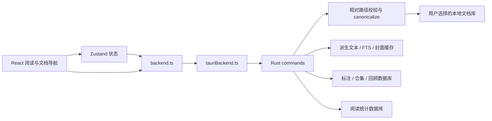

# Reade 项目评估与十项优化

日期：2026-09-12。基于本地工作区 `D:/Agent/13_Reade/reade`，起点提交 `f4cbbfc`，分支 `codex/project-optimization-20260912`。

本次评估包含开始时已有的未提交修改。它们已记录文件哈希与 diff 基线；本次实现不覆盖这些修改，不提交或推送。以下判断来自源码、回归测试和本地运行，不依赖过时的项目规模描述。

## 1. 项目速览与总体判断

Reade 的产品能力已较完整。React 阅读界面、Tauri 文件边界、独立 SQLite 数据层和按需加载的重型渲染器值得保留。本轮最有价值的工作是处理异步任务归属、持久化身份和重复计算，暂不进行整套架构或 UI 重写。

- 技术栈：React 19 / TypeScript 5 / Zustand 5 / Vite 7；Tauri 2 / Rust 2021 / SQLite。
- 工作区环境：Node 24.15.0、pnpm 11.5.2、Cargo 1.94.0。
- 规模口径：`src`、`src-tauri/src`、`scripts` 下的 `.ts/.tsx/.rs/.mjs/.css`，含测试、不含依赖及构建产物；检查时共 312 个文件、约 10.2 万非空行。该数字包含本次新建的前端查找测试。
- 前端入口为 `src/main.tsx`；Tauri 在 `src-tauri/src/lib.rs` 初始化数据层、插件与命令。
- `App.tsx` 仍为 5,660 行，承担大量编排，长期维护成本较高；`App.css` 已拆为五层样式导入，不能再把它当成六千行单体 CSS。

## 2. 架构还原

| 模块 | 职责与边界 | 代码依据 |
|---|---|---|
| React App | 组合阅读器、导航、标注及延迟加载的二级视图 | `src/App.tsx:344` |
| Backend facade | 根据构建运行时选择实现；桌面通过动态导入进入 Tauri wrapper | `src/lib/backend.ts:291`、`:301`、`:326` |
| Tauri commands | 注册 IPC 命令，集中初始化状态与权限插件 | `src-tauri/src/lib.rs:61`、`:121` |
| 文件边界 | 拒绝空路径、绝对路径、父目录；canonicalize 后验证仍在库内 | `src-tauri/src/library_paths.rs:5`、`:31` |
| Markdown 安全渲染 | URL 解析前后双校验，Mermaid 输出消毒后注入 | `src/components/MarkdownRenderer.tsx:437`、`:515` |
| 本机存储 | 派生缓存与用户数据分开；标注库和统计库使用应用数据目录 | `src-tauri/src/lib.rs:63`、`:82` |

典型打开链路：界面选择书库 → store 调用 `backend.openLibrary` → `tauriBackend.openLibrary` 发 `open_library` → Rust 验证根目录、扫描并返回快照 → 前端选择文档并通过同一 facade 获取内容。路径的显示拼写与书库的身份需要分开处理；本轮第 4 项修复的是前端轻量状态的身份问题，不改变 Rust 文件权限边界。

## 3. 十项优化及证据

| # | 优先级 | 原问题与影响 | 本轮实现 / 验收目标 |
|---|---|---|---|
| 1 | 高 | 查找的旧 PDF 请求在新查询防抖期间仍可回填；卸载后还可能画高亮，连续跳转留下多个滚动重试 | 统一取消防抖、异步请求世代、滚动重试及聚焦帧；关闭、换模式、卸载都失效。`src/lib/useDocumentFind.ts:71` |
| 2 | 中 | 每个命中都重建全文 DOM 文本索引，命中越密集重复工作越多 | 高亮与文档地图均按阅读表面或 PDF 页构建一次索引，复用构造所有 Range；每轮后释放 DOM 引用。`src/lib/documentFindAdapters.ts:97`、`src/App.tsx:2213` |
| 3 | 中 | `toLowerCase()` 可能改变 UTF-16 长度，如 `İ`；旧结果截取和高亮会偏移 | 为发生长度变化的位置保存偏移映射，将归一化匹配映回原文；普通文本走无映射快速路径。`src/lib/documentFind.ts:35` |
| 4 | 高 | 同一 Windows 书库的大小写、斜杠或 verbatim 路径拼写产生多份状态；旧键归一化时碰撞可能覆盖记录 | `libraryKey.ts` 与 `localEnvelope.ts` 统一轻量状态库键，兼容旧键并合并重复库；保留各文档最新记录和显式 PDF 进度重置，POSIX 路径仍区分大小写 |
| 5 | 高 | 旧库封面读取或离屏渲染在切库后完成，可能覆盖新库的同名文档封面 | 封面请求绑定书库世代；写入前再次检查任务归属，切库重建去重集合。`src/components/BookshelfView.tsx:175`、`src/lib/coverCapture.ts:47` |
| 6 | 中 | Markdown 图片成功回调有失效检查，但失败回调和卸载清理不足 | 换文档和卸载后丢弃旧结果及旧错误，清理未完成的状态更新。`src/lib/useMarkdownImageAssets.ts:61`、`:203` |
| 7 | 中 | 多图文档一次发起全部资源 IPC；批量写回仍逐项复制整个 map | 单阅读面最多 4 个在途读取，取消旧队列；旧读结束后再腾出槽位，每批状态只复制一次。`src/lib/useMarkdownImageAssets.ts:45`、`:109` |
| 8 | 中 | 每索引一个文档都聚合快照数据做容量检查，并发送进度事件 | 先用 SQLite 已用页数判断是否可能超限，预算内跳过快照聚合；进度事件限制约每 100ms 一次，最终事件必达。仍逐文档检查容量，不改变软预算、低水位和 LRU。`src-tauri/src/library.rs:2827`、`:1948` |
| 9 | 中 | 每次链接查询遍历全库 wiki 链接并逐条解析 | 仅查询能解析到目标文档的至多两个 stem，复用已有 SQL 索引；WikiIndex 仍由当前快照构造，刷新和歧义语义不变。`src-tauri/src/library.rs:3152` |
| 10 | 中 | 打开设置即对两个持久化数据库执行完整 integrity_check | 状态读取使用 quick_check(1)；备份、恢复和显式诊断保留完整校验，不降低恢复可信度。`src-tauri/src/sqlite_io.rs:37`、`src-tauri/src/diagnostics.rs:305`、`:367` |

所有优化均以桌面使用为目标，不新增依赖、云服务、权限或 Web 专用功能。第 8、9 项较初始方案收窄：保留即时预算与现有失效链，仅消除有证据的重复开销。

## 4. 关键机制深挖

**异步任务如何跟随文档和书库？** 部分逻辑已有请求世代或 Promise 身份判断，但覆盖不完整：查找延迟到下一次真正搜索时才失效；图片仅处理成功路径；封面主要依赖组件是否存活。它们不能仅凭相同相对路径判定归属。本轮将失效提前到用户意图变化处，覆盖成功、失败、队列和最终副作用。代码证据见第 1、5、6、7 项；置信度高。

**密集命中的代价在哪里？** `buildTextIndex` 本身已支持复用与二分定位，但查找适配器原来为每个结果重新调用它。本轮批量 API 在一次绘制内共享索引，在下次绘制重新建立，兼顾性能与 DOM 更新安全。`src/lib/documentFindAdapters.ts:97`；置信度高。

**用户数据和派生缓存能否分开维护？** 能。Tauri 初始化中明确把用户数据库和统计数据库放在应用数据目录，缓存独立。本轮只优化预算内检查与已有索引的查询，不改变用户数据 schema、不新增缓存索引、不触发全库缓存版本升级。`src-tauri/src/lib.rs:63`、`:82`；置信度高。

**渲染安全是否需要放宽？** 不需要。路径 canonicalize、Markdown 双重 URL 校验、SVG 消毒与按需加载仍成立。本轮性能和可靠性修改不放宽 CSP、capability、文件大小限制或远程图片策略。`src-tauri/src/library_paths.rs:31`、`src/components/MarkdownRenderer.tsx:515`；置信度高。

## 5. 声明与实现比对

| 声明 | 核实结果 | 判定 |
|---|---|---|
| README：本地优先，不执行书内 HTML/CSS | 前端安全 DTO、Markdown 默认管线及 Rust 文件边界与之相符；没有为本轮增加网络路径 | 一致 |
| README：Shiki/Mermaid 懒加载 | 渲染器仍使用动态导入；PDF、统计等二级视图也由 React.lazy 加载 | 一致 |
| README：记住逐文档阅读位置 | 正常原路径重开有效；Windows 路径别名暴露状态分桶问题，本轮修复 | 存在边界缺陷 |
| AGENTS：App.css 为六千行单体 | 实际为 6 行样式入口，导入五个拆分文件 | 文档滞后；本次不改 AGENTS |
| AGENTS：CI 仅部署 Pages，不跑测试 | 现有 `.github/workflows/verify.yml` 含前端测试/类型/构建和 Windows Rust 检查；Pages 依赖 verify | 文档滞后；未把远端 CI 当成本地验收 |
| AGENTS：用户数据库位于 cache 目录 | 当前实现已迁到 app_data_dir，并保留旧库迁移路径 | 文档滞后；维护以实际代码为准 |

不把“初始 JS 较大”直接等同于必须添加 manualChunks：拆包不自动减少必要模块的总下载和解析量。本轮不做缺乏冷启动对照证据的构建拆包。

## 6. 值得保留和复用的设计

- **Backend facade + IPC 契约核对**：界面只面向统一 wrapper，命令集合由测试机械核对（`src/lib/backend.ts:301`、`src/lib/tauriBackend.test.ts`）；适用于桌面壳与多运行时共享界面。
- **索引与 Range 分离**：文本节点索引可在多次定位中复用，Range 构造使用二分定位（`src/lib/annotations.ts:361`、`:396`）；适用于批量标注、高亮与长文导航。
- **派生数据和用户数据分库**：清缓存不能误删标注和统计（`src-tauri/src/lib.rs:63`、`:82`）；适用于可重建索引与不可重建用户记录并存的本地应用。
- **输入、解析后输出双校验**：URL resolver 前后的安全检查共同约束不可信解析结果（`src/components/MarkdownRenderer.tsx:515`）；适用于插件、转换器和自定义资源 resolver。

## 7. 实际验证

最终验证结果：

- 原始工作区 `pnpm test` 在本机默认高并发下有 worker 启动超时，并有一个超时相关测试失败；`pnpm test --maxWorkers=4` 重跑 131 文件、1,558 测试全部通过。未为环境问题修改产品配置。
- 查找定向测试通过；生命周期测试修复前 6 项失败，Unicode 偏移测试修复前 2 项失败。最终查找相关 20 项、书库身份相关 156 项及封面相关 13 项定向检查通过。
- `pnpm test --maxWorkers=4`：135 文件、1,607 测试全部通过；相较初始工作区增加 49 项前端测试。
- `pnpm exec tsc --noEmit`：通过。
- 收尾补充 Windows 盘符根（`D:\` / `d:/`）的大小写归一边界后，重跑路径身份、存储信封与阅读位置 38 项测试及类型检查，通过。
- `cargo test --manifest-path src-tauri/Cargo.toml`：163 通过、0 失败、1 个既有测量用例忽略；`perf_baseline_scan_index_search_on_synthetic_library` 属于需要显式运行的 D10 测量用例，本轮未运行。
- `cargo fmt --manifest-path src-tauri/Cargo.toml --check` 与 `cargo clippy --manifest-path src-tauri/Cargo.toml --all-targets -- -D warnings`：通过。
- `pnpm build`：通过；`READE_CONTENT_DIR=examples/demo-library` 下 `pnpm build:web`：通过。后者只核对封存版本的构建兼容性，未发布站点；最后重新执行桌面构建，因此 `dist` 保持桌面产物。
- Vite 仍提示部分 chunk 超过 500 kB：桌面入口约 1,026 kB（gzip 322 kB）。未提高警告阈值掩盖提示；懒加载的大型渲染模块保持分离。未打包 NSIS、未做安装验收。
- 真实 Edge + 默认 desktop Vite 前端：注入合成书库状态及 IPC fixture，不连接用户数据库；测试 `Ctrl+F`、Unicode 高亮、200 个命中和关闭后清理。
- 截图：`output/project-audit/light-wide.png`、`dark-wide.png`（1200×800），`light-narrow.png`、`dark-narrow.png`（760×620）。检查时无页面横向溢出，查找框、计数、导航按钮和正文正常。
- 局部性能对照：7,912 字符、200 命中，Edge 开发构建同一页面内 5 次样本；逐条 Range 构造约 3.1–3.9ms，批量构造约 0.1ms。这是算法局部对照，受浏览器计时精度影响，不代表冷启动或全文总渲染性能。

## 8. 边界、风险和实施记录

采用分层采样：入口、构建/权限配置、后端索引/查询、渲染资源和持久化路径重点审查；未逐行穷尽全部 10 万行，也未审计第三方依赖源码。Web 路径仅做现有兼容性验证，不扩展能力。

浏览器截图使用桌面前端和模拟 IPC，不能替代真实 Tauri 原生文件对话框、WebView2 IPC、安装包或大库长时间压力测试。启动 fixture 前出现的缺失 Tauri 回调错误属于浏览器环境不具备原生壳；注入后本次阅读/查找操作无新增错误。

实施取舍：不按库数量自动淘汰阅读位置、页码或用户设置；不把主副栏分别调用的 hook 误判为同一个实例；不为降低状态页开销削弱备份与恢复的完整性检查。

协调记录：子任务曾误建并切换到同起点的 `codex/project-optimization-pass`，并超范围编辑 MarkdownRenderer；根任务核实两分支提交完全相同后恢复原分支、移除多余分支并撤回该额外改动。所有最终验证在原定分支集中进行。未对用户原有修改做恢复或回滚。

原有修改复核：基线文件哈希除 `src-tauri/src/user_store.rs` 外均相同；该文件仅追加了 11 行 `quick_check_ok` 方法，原有迁移测试修改完整保留。`Cargo.toml`、迁移代码、PDF 缩放、设置与样式等用户原有修改未被改写。`git diff --check` 通过；没有提交或推送。
